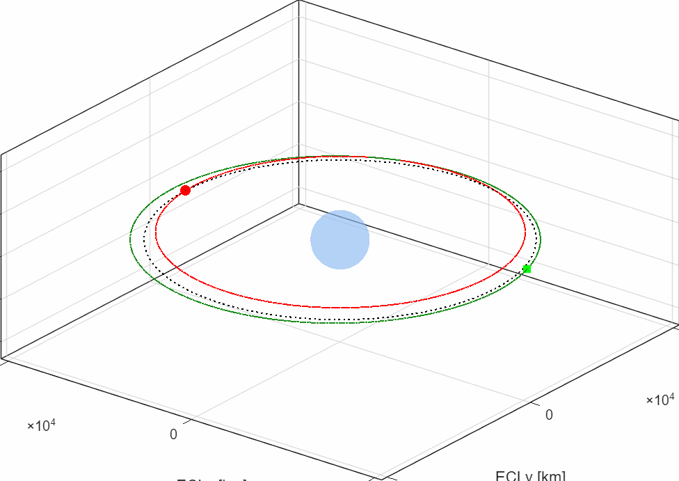

# SPACE312 Final Project

## GTO-to-GEO Transfer Trajectory Optimization for GEO-KOMPSAT-2A

Earth-centered two-body dynamics, Lambert transfer trajectories, and Pareto
tradeoff analysis were used to design a practical rendezvous trajectory from an
initial GTO state to the GEO-KOMPSAT-2A target spacecraft.

---

# Project Summary

| Item | Value |
| --- | --- |
| Mission | GTO -> GEO-KOMPSAT-2A Rendezvous |
| Dynamics | Earth-centered Two-Body |
| Search Method | Lambert + Pareto Filtering |
| Selected Method | MultiRevLambert |
| Transfer Duration | 3.4709 days |
| Total Delta V | 1.8400 km/s |
| Final Position Error | 0.000137 km |

### Mission Priority

1. Rendezvous within 4 days
2. Minimize total Delta V
3. Maintain realistic GEO operational feasibility

---

# Mission Scenario

Unlike a conventional GEO insertion problem, the target GEO spacecraft is
treated as a moving rendezvous target.

Both spacecraft are propagated using identical Earth-centered two-body dynamics.



---

# Problem Definition

Given:

- Initial GTO state vector
- GEO-KOMPSAT-2A state vector
- Transfer duration candidate

Find:

- Transfer trajectory
- Departure maneuver
- Arrival maneuver

Such that the transfer spacecraft matches the target spacecraft state at the
final rendezvous epoch while minimizing total Delta V and transfer duration.

---

# Dynamics Model

The spacecraft motion is modeled using Earth-centered inertial two-body
dynamics:

```math
\ddot{r} = -\mu r / |r|^3
```

Assumptions:

- No J2 perturbation
- No atmospheric drag
- No solar radiation pressure
- No third-body effects

---

# Optimization Workflow

```text
Transfer Duration Sweep
        |
        v
Target Propagation
        |
        v
Lambert Solver
        |
        v
Delta V Evaluation
        |
        v
Rendezvous Error Analysis
        |
        v
Pareto Filtering
        |
        v
Representative Solution Selection
```

---

# Lambert Transfer Evaluation

Departure burn:

```text
Delta V1 = ||V_departure - V_GTO||
```

Arrival burn:

```text
Delta V2 = ||V_target - V_arrival||
```

Total maneuver cost:

```text
Delta Vtotal = Delta V1 + Delta V2
```

---

# Results

## Candidate Solutions

| Method | TOF [days] | Total Delta V [km/s] |
| --- | --- | --- |
| Lambert | 1.0000 | 3.4652 |
| Lambert | 1.2610 | 2.8004 |
| MultiRevLambert | 3.4709 | 1.8400 |
| MultiRevLambert | 10.7387 | 1.8162 |

## Pareto Observation

- Transfer duration increases generally reduce total Delta V.
- Short transfers require aggressive phasing maneuvers.
- Multi-revolution Lambert solutions provide significant fuel savings.

---

# Why 3.4709 Days?

The minimum-Delta V solution was not selected directly.

Selection criteria:

- Rendezvous completion within 4 days
- Low total Delta V
- Stable GEO commissioning timeline

The selected 3.4709-day MultiRevLambert solution satisfies all operational
constraints while maintaining strong fuel efficiency.

---

# Representative Design Point

| Parameter | Value |
| --- | --- |
| Method | MultiRevLambert |
| Revolution Count | 3 |
| Transfer Duration | 3.4709 days |
| Delta V1 | 1.6784 km/s |
| Delta V2 | 0.1616 km/s |
| Total Delta V | 1.8400 km/s |
| Position Error | 0.000137 km |

---

# Generated Outputs

- Pareto front figures
- 3D transfer trajectory figures
- Radius history plots
- Maneuver magnitude plots
- Visibility analysis figures
- Rendezvous animation
- CSV result tables

---

# Repository Structure

```text
SPACE312_Final_Project/
|-- README.md
|-- SPACE312_Final_Project.docx
|-- SPACE312_Final_Project_Main.m
|-- results/
    |-- DeltaV_Maneuvers.png
    |-- FinalProject_ParetoResults.csv
    |-- FinalProject_ReportSolutions.csv
    |-- GTO_to_GEO_KOMPSAT2A_Animation.gif
    |-- KHU_Visibility.png
    |-- Pareto_dV_vs_TOF.png
    |-- Position_Error_Final_Window.png
    |-- Radius_vs_Time.png
    |-- Trajectory3D.png
```

---

# How to Run

Open MATLAB in the repository root and run:

```matlab
SPACE312_Final_Project_Main
```

The script regenerates the transfer search, exports CSV files, and creates the
figures and animation under `results/`.

---

# References

1. Howard D. Curtis, *Orbital Mechanics for Engineering Students*.
2. David A. Vallado, *Fundamentals of Astrodynamics and Applications*.
